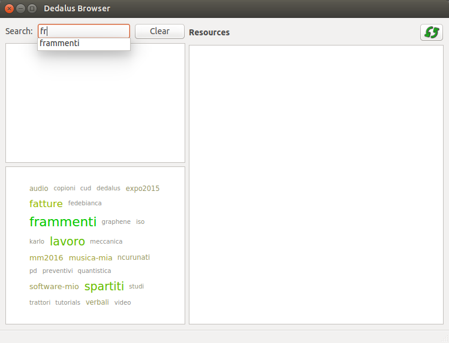
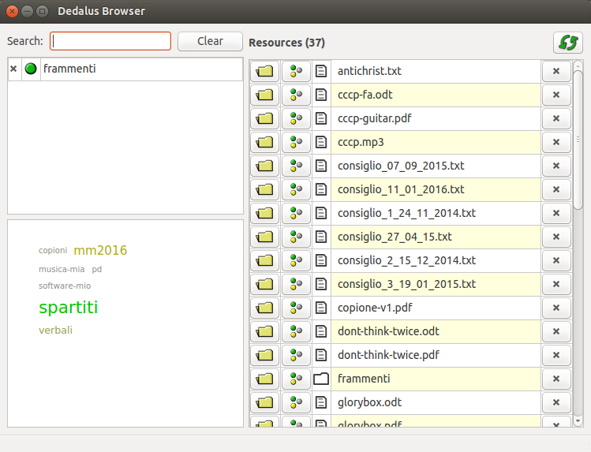

#  Dedalus

## Overview

Dedalus aims to be a system that allows you to organize resources by tags. 
Resources can be documents on your hard disk, web resources, emails, personal contacts etc.

The purpose is to overcome the inherent limitations of simple structures like 
lists or trees you have on your file system, browser bookmarks and so forth. 
By using tags you can access the same resource through different paths, create dynamic
sub-collections based on having (or *not* having) a set of tags, create a semantic network
where tags are linked to each other. All this should help you greatly in browsing and finding
documents in large collections.

I'm writing this trying to solve the problem of a friend of mine who is doing a Phd
in antropology and who has lots of documents, interviews, pictures, web resoures and so 
forth, whose conceptual classification requires definitely something more flexible than
a bunch of directories and sub-directories. 


Dedalus has three components: 

- [dedalus-server](#dedalus-server)
- [dedalus-tagger](#dedalus-tagger)
- [dedalus-browser](#dedalus-browser)

### <a name="dedalus-server"></a>dedalus-server

This is the dedalus backend on top of which the 
GUIs operate. It is written in nodejs, and largely based on a library called 
[tagman](https://github.com/xzoert/tagman), which does most of the job. 
Data are saved on an sqlite3 database, located at *~/.tagman/default.sql*.

### <a name="dedalus-tagger"></a>dedalus-tagger

This is the GUI for tagging resources, with tag autocompletion, 
multiple resource editing, and whose aim is to be as easy and handy to use as it can be. 


The tagger can be invoked by right clicking on a file or directory 
in your file manager (using [nautilus-actions](http://www.nautilus-actions.org/) for nautilus,
configuring a *custom action* in thunar etc.).
Also there is a nice [extension for Firefox](https://addons.mozilla.org/en-US/firefox/addon/open-with/) 
that can easily be configured to open the dedalus-tagger for tagging the current web page.
It is pretty easy as well to create an open/libre-office macro which opens the dedalus-tagger
on the currently edited document.

### <a name="dedalus-browser"></a>dedalus-browser

The browser lets you navigate through the tagged resources. It creates a tag cloud
contextual to the current search criteria.





### State of the project
Dedalus is at its very early stage of development, but the main functionalities are 
in place and the GUIs, though very simple, are in fact quite usable. There is no 
fancy installation process by now, just a makefile that works on my computer and should 
work on recent ubuntu distros. I do not guarantee by now that future versions will be
entirely compatible with the current one, but I'm pretty sure that any needed migration
will be quite easy to perform.

Anyone interested in contributing is very welcome. 

## Installation

The current Makefile has been tested on ubuntu 15.10 and 16.04, but is likely to work 
on 16.10 as well. 

You might want to edit manually the Makefile in order to meet your system. If you do so successfully,
please let me know! 

The first step is to clone the dedalus repository somewhere.

	```
	git clone https://github.com/xzoert/dedalus.git
	```

Then enter the dedalus directory by typing:

	```
	cd dedalus
	```

